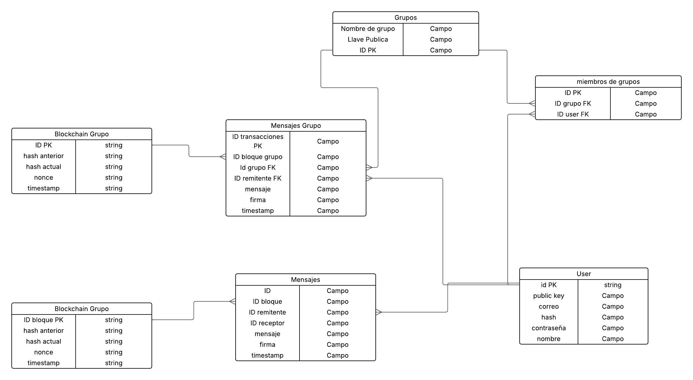

# Proyecto2-Cifrados

## Diagrama UML de base de datos

Este modelo de base de datos está diseñado para gestionar mensajes entre usuarios y grupos, integrando tecnología *Blockchain* para asegurar la integridad de los mensajes. A continuación se detallan las tablas y sus relaciones:

---

## 🧑‍💼 User

Contiene información de cada usuario del sistema.

| Campo       | Tipo   | Descripción                        |
| ----------- | ------ | ---------------------------------- |
| id\_pk      | string | Identificador primario del usuario |
| public\_key | string | Llave pública del usuario          |
| correo      | string | Correo electrónico                 |
| hash        | string | Hash de la contraseña              |
| contraseña  | string | Contraseña del usuario             |
| nombre      | string | Nombre completo del usuario        |

---

## 💬 Mensajes

Almacena los mensajes privados entre usuarios.

| Campo         | Tipo   | Descripción                          |
| ------------- | ------ | ------------------------------------ |
| id            | string | ID del mensaje                       |
| id\_bloque    | string | FK al bloque blockchain asociado     |
| id\_remitente | string | FK al usuario que envió el mensaje   |
| id\_receptor  | string | FK al usuario que recibió el mensaje |
| mensaje       | string | Contenido del mensaje                |
| firma         | string | Firma digital del mensaje            |
| timestamp     | string | Fecha y hora del mensaje             |

---

## 🧱 Blockchain Grupo

Tabla que actúa como cadena de bloques para registrar los mensajes (tanto individuales como grupales).

| Campo          | Tipo   | Descripción                               |
| -------------- | ------ | ----------------------------------------- |
| id\_bloque\_pk | string | Identificador único del bloque            |
| hash\_anterior | string | Hash del bloque anterior                  |
| hash\_actual   | string | Hash del bloque actual                    |
| nonce          | string | Nonce utilizado para la prueba de trabajo |
| timestamp      | string | Fecha y hora de creación del bloque       |

---

## 👥 Grupos

Define los grupos de usuarios para mensajería grupal.

| Campo             | Tipo   | Descripción                        |
| ----------------- | ------ | ---------------------------------- |
| id\_pk            | string | ID del grupo                       |
| nombre\_de\_grupo | string | Nombre del grupo                   |
| llave\_publica    | string | Llave pública compartida del grupo |

---

## 🧑‍🤝‍🧑 Miembros de grupos

Relación entre usuarios y grupos (muchos a muchos).

| Campo         | Tipo   | Descripción       |
| ------------- | ------ | ----------------- |
| id\_pk        | string | ID de la relación |
| id\_grupo\_fk | string | FK al grupo       |
| id\_user\_fk  | string | FK al usuario     |

---

## 🧾 Mensajes Grupo

Contiene los mensajes enviados dentro de un grupo.

| Campo                 | Tipo   | Descripción                        |
| --------------------- | ------ | ---------------------------------- |
| id\_transacciones\_pk | string | ID del mensaje grupal              |
| id\_bloque\_grupo     | string | FK al bloque blockchain            |
| id\_grupo\_fk         | string | FK al grupo destinatario           |
| id\_remitente\_fk     | string | FK al usuario que envió el mensaje |
| mensaje               | string | Contenido del mensaje              |
| firma                 | string | Firma digital del remitente        |
| timestamp             | string | Fecha y hora del mensaje           |

---

## 🔄 Relaciones Clave

* Mensajes y Mensajes Grupo están enlazados a la tabla Blockchain Grupo, asegurando que todos los mensajes se registran como parte de una cadena de bloques.
* User se relaciona con Mensajes tanto como remitente como receptor.
* User también se relaciona con Mensajes Grupo y Miembros de Grupos como parte de la mensajería grupal.
* Grupos está vinculado a Mensajes Grupo y Miembros de Grupos.

---